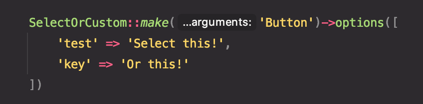
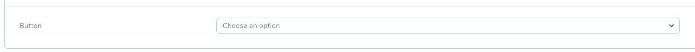
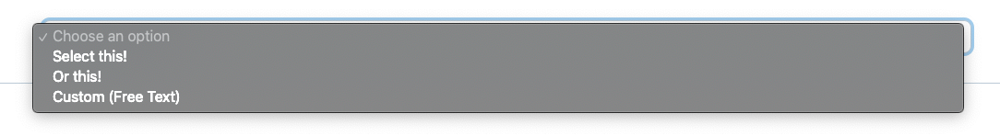
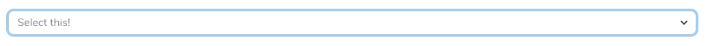

# select-or-text

Laravel Nova custom field that allows you to have a select drop-down or custom text!


## Install

You can install `select-or-text` using composer:

```
composer require lynndigital/select-or-custom
```

Then add the following code to your resources `fields` method:

```php
\Lynndigital\SelectOrCustom\SelectOrCustom::make('Field Name')->options([]);
```

The field has an `options` method similar to that of Laravel Nova's `Select` field, it allows you to pass default options that may be selected.

## Screenshots:

Add the field to nova:


The select field.


Select one of your provided options, or choose "Custom (Free Text)" to add a custom value.


The field when a provided option is selected:


The field when a custom value can be entered (a simple text field):
